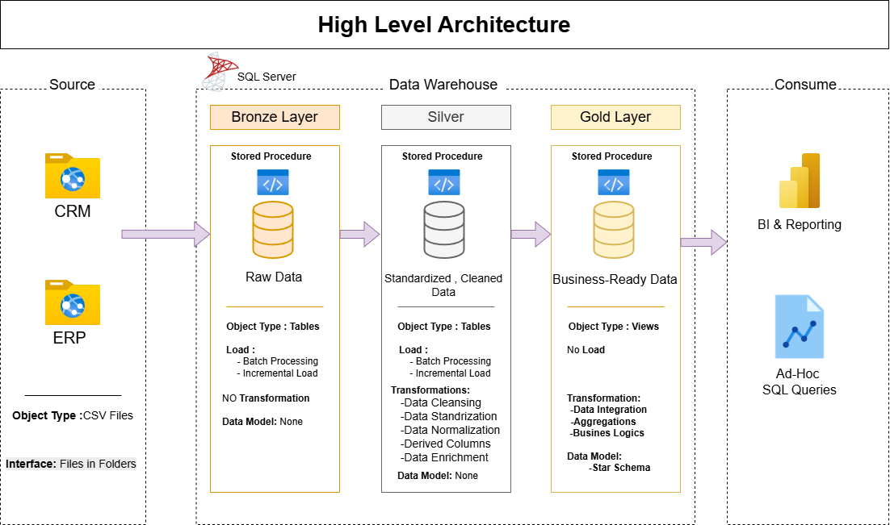
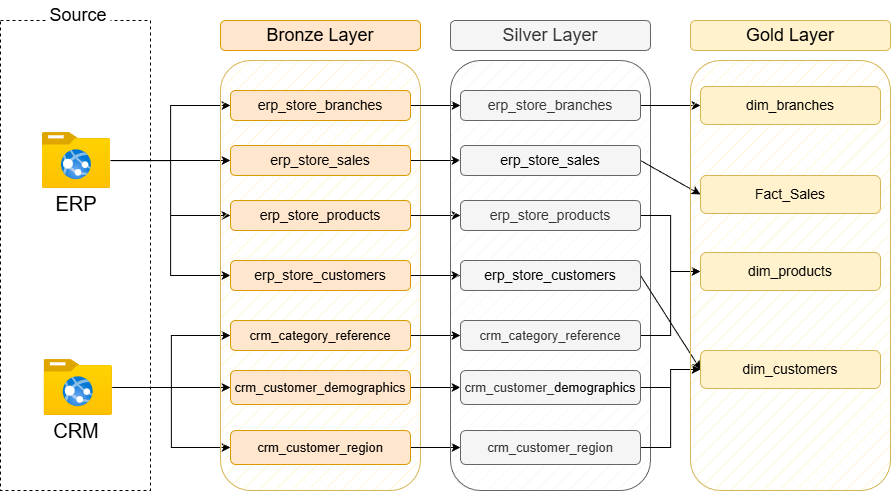
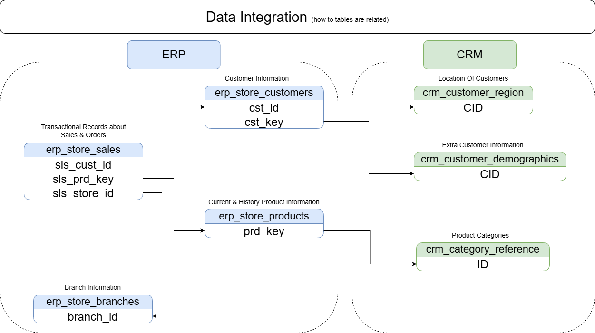
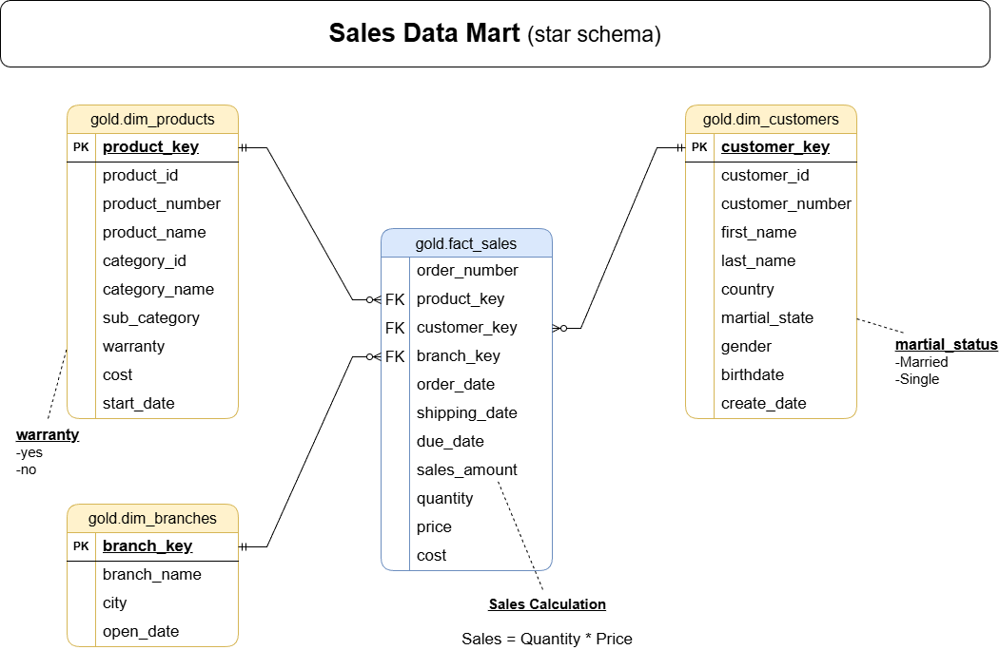

# 🏢 Electronics Retail Data Warehouse

A complete, production-style Data Warehouse built from scratch using the
**Medallion Architecture** (Bronze → Silver → Gold) on **SQL Server**,
simulating a real electronics retail chain that integrates data from two
independent source systems (**ERP** and **CRM**) delivered as monthly CSV
file drops.

---

## 📖 Business Context

The fictional company operates multiple physical branches selling electronics
(mobile devices, computers, gaming, displays, accessories). Every month, two
separate source systems export their data as CSV files:

- **ERP System** — operational data: branches, customers (core profile),
  products, and sales transactions.
- **CRM System** — customer enrichment data: demographics, region, and
  product category reference.

The goal of this project is to build a warehouse that **ingests these monthly
drops incrementally** (not a full reload every time), cleans and integrates
the two systems into a single source of truth, and exposes a clean **Star
Schema** ready for BI tools, ad-hoc analysis, and future ML use cases.

---

## 🏗️ Architecture



| Layer  | Object Type | Load Strategy              | Transformations                                                      |
|--------|-------------|-----------------------------|-----------------------------------------------------------------------|
| Bronze | Tables      | Batch + Incremental (Append)| None — raw mirror of source files                                     |
| Silver | Tables      | Batch + Incremental (Upsert)| Cleansing, standardization, de-duplication, SCD1/SCD2, system integration |
| Gold   | Views       | *No load — always fresh*    | Business logic, aggreg­ation-ready modeling, Star Schema               |

### Data Flow Across Layers



### How the Two Source Systems Integrate



---

## 📂 Repository Structure

```
├── datasets/                     # Source CSV files, split by batch
│   ├── initial_load/
│   ├── monthly_batch_1/
│   ├── monthly_batch_2/
│   └── monthly_batch_3/
│
├── docs/                          # Architecture & schema diagrams
│   ├── data_architecture.png
│   ├── data_flow.png
│   ├── data_integration.png
│   └── data_model.png
│
├── bronze/
│   ├── DDL_Tables_Create.sql
│   ├── DDL_Log_Table.sql
│   ├── load_bronze_step_1.sql    # bulk_insert_form (dynamic BULK INSERT engine)
│   ├── load_bronze_step_2.sql    # load_form (per-table controller + idempotency)
│   ├── load_bronze_step_3.sql    # load_to_bronze (master orchestrator)
│   └── README.md
│
├── silver/
│   ├── DDL_Tables_Create.sql
│   ├── DDL_Log_Table_Create.sql
│   ├── func_get_unloaded_batches.sql
│   ├── proc_silver_load.sql       # load_to_silver (cleansing + MERGE/SCD2/Append)
│   └── README.md
│
├── gold/
│   ├── DDL_gold.sql                # dim_customers, dim_products, dim_branches, fact_sales
│   ├── data_catalog.md
│   └── README.md
│
└── README.md                       # (this file)
```

---

## ⚙️ Key Engineering Features

### Incremental Loading, End-to-End
Because the source systems only ever send **new or changed data** each
month, the warehouse never truncates and reloads historical data. Instead:
- **Bronze** always **appends** every batch, tagged with `dwh_batch_name`.
- **Silver** auto-discovers which batches are pending per table via
  `silver.get_unload_batches_inline()` (an `EXCEPT` between the Bronze and
  Silver load logs) — no manual batch tracking required.
- **Gold** needs no load step at all — it's pure Views on top of Silver.

### Idempotency & Auditability
Both Bronze and Silver maintain a dedicated `load_log` table recording
`begin_load` / `commit_load` / `failed` / `skipped_no_file` per table, per
batch. Re-running a load is always safe: a batch already marked
`commit_load` for a given table is never reprocessed, and a failed batch
automatically rolls back its partial inserts before retry.

### Dynamic, Reusable Loading Engine (Bronze)
Rather than writing repetitive `BULK INSERT` statements for each of the 7
source tables, a single dynamic-SQL procedure
(`bronze.bulk_insert_form`) builds a temporary view that maps CSV columns
positionally to the correct target columns (excluding DWH metadata),
executes the `BULK INSERT`, then tags the new rows with the batch name.

### Strategic Load Patterns per Table Type (Silver)
| Table type                                  | Pattern            | Why                                                            |
|----------------------------------------------|---------------------|------------------------------------------------------------------|
| Reference data (`category_reference`, `branches`) | MERGE (Upsert)  | Rarely changes, safe to always sync                              |
| Slowly-changing attributes (`customers`, `demographics`, `region`) | MERGE (Upsert) — **SCD Type 1** | Old values (e.g. marital status) have no analytical value once changed |
| Priced products (`products`)                 | Rebuild-affected-keys — **SCD Type 2** | Historical prices must be preserved for accurate time-based revenue analysis |
| Transactions (`sales`)                        | Append-only          | Immutable once recorded                                          |

### Data Cleansing Highlights
- Standardizing inconsistent categorical values (gender, marital status,
  region names) via `CASE` mapping.
- Reconciling different ID formats between the two source systems
  (`OLD` prefixes, dash-delimited region IDs) so records join correctly.
- Converting integer-encoded dates (`20251031`) to proper `DATE` types,
  treating zero/invalid values as `NULL`.
- Recalculating `sales_amount` and `price` when the source values are
  missing, zero, negative, or mathematically inconsistent
  (`sales ≠ quantity × price`).
- Correct **SCD2** `prd_end_dt` calculation using `LEAD()` over each
  product's price history, so that closing an old price version and
  opening a new one never leaves gaps or overlaps.

---

## 🐞 Real Data-Quality Issues Found & Resolved

Documenting real issues discovered while building this pipeline (not just
theoretical ones) — a good showcase of practical debugging skills:

1. **Join fan-out from unhandled SCD2 versions** — querying Bronze directly
   (joining sales to products on `prd_key` alone) silently doubled matching
   rows whenever a product had more than one price version. Fixed by joining
   on the effective date range in Silver, not just the business key.
2. **Non-unique product names** — some unrelated products coincidentally
   share the exact same marketing name; only `prd_key`/`prd_id` can be
   trusted as a unique business key.
3. **Mismatched ID formats across systems** — customer IDs in the CRM region
   file used a different format (`EG-20005`) than the ERP customer key
   (`EG00020005`), requiring explicit parsing/reformatting before joining.
4. **MERGE conflicts when multiple pending batches accumulate** — merging
   more than one unprocessed batch at once could match the same target row
   twice; solved with `ROW_NUMBER()` de-duplication before every `MERGE`.

---

## ⭐ Gold Layer — Star Schema



Full column-level documentation: [`Gold/data_catalog.md`](Docs/data_catalog.md)

---

## 🚀 How to Run

```sql
-- 1) Create the database, schemas, and all tables (Bronze + Silver DDL scripts)
-- 2) Load a new batch into Bronze
EXEC bronze.load_to_bronze
    @folder_name = 'initial_load',
    @batch_value = 'initial_data';

-- 3) Propagate all pending batches from Bronze into Silver
EXEC silver.load_to_silver;

-- 4) Query the Gold layer directly — always up to date, no load step needed
SELECT * FROM gold.fact_sales;
```

Repeat steps 2–3 for each new monthly batch (`monthly_batch_1`,
`monthly_batch_2`, `monthly_batch_3`, ...).

---

## 📊 Example Analytical Questions This Model Enables

- Which branch generates the highest revenue per month?
- Which product category has the best profit margin (`sales_amount - cost`)?
- What is the customer retention/repeat-purchase rate by region?
- How did average order value change month over month?
- Which products were discontinued, and what was their sales trend before
  being phased out?

---

## 🛠️ Tech Stack

- **Database:** SQL Server (T-SQL)
- **Techniques:** Stored Procedures, Dynamic SQL, Table-Valued Functions,
  `BULK INSERT`, `MERGE` (Upsert), SCD Type 1 & Type 2, Window Functions
  (`LEAD()`, `ROW_NUMBER()`), Views, Star Schema Dimensional Modeling
- **Data Generation:** Python (synthetic dataset generation with
  intentional data-quality issues for realistic cleansing practice)

---

## 🔭 Possible Future Extensions

- Add a `product_price_history` fact/bridge to support historically-accurate
  margin analysis (full SCD2 dimension instead of current-snapshot-only).
- Move file paths and credentials out of hardcoded strings into a
  configuration table or environment variables.
- Add SQL Server Agent Job scheduling to automate monthly batch ingestion.
- Layer a Power BI dashboard and a Python/EDA notebook directly on top of
  `gold.fact_sales`.

---

## 👤 Author

Built as part of a Data Analyst portfolio project, covering the full
lifecycle of a real-world Data Warehouse: dataset design, ETL engineering,
data cleansing, dimensional modeling, and documentation.
