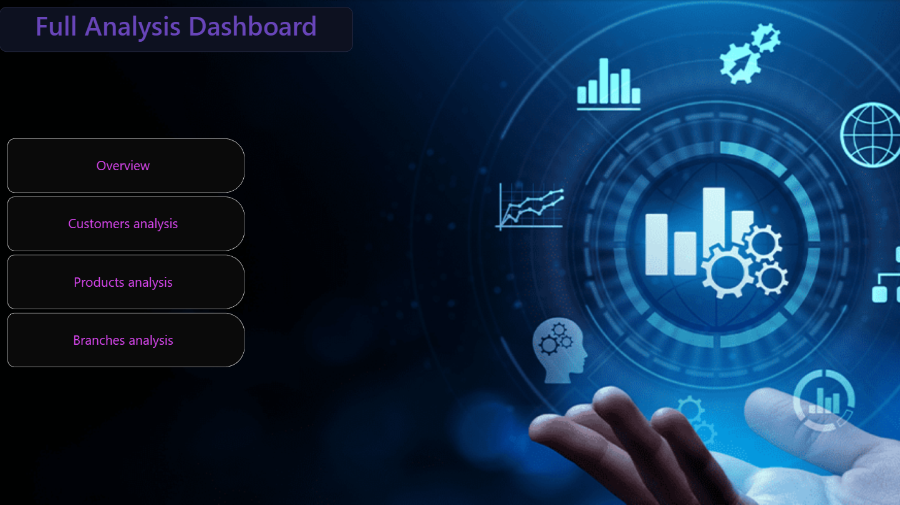
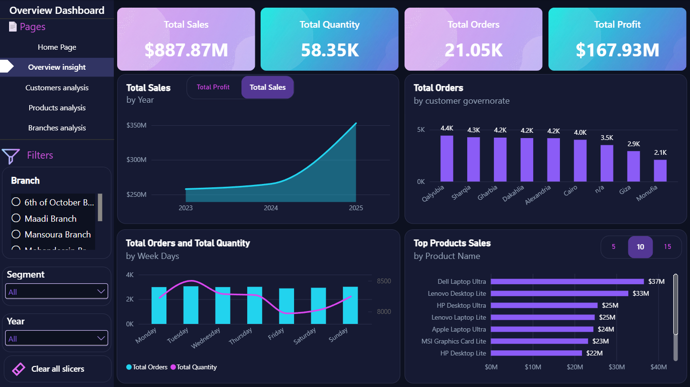
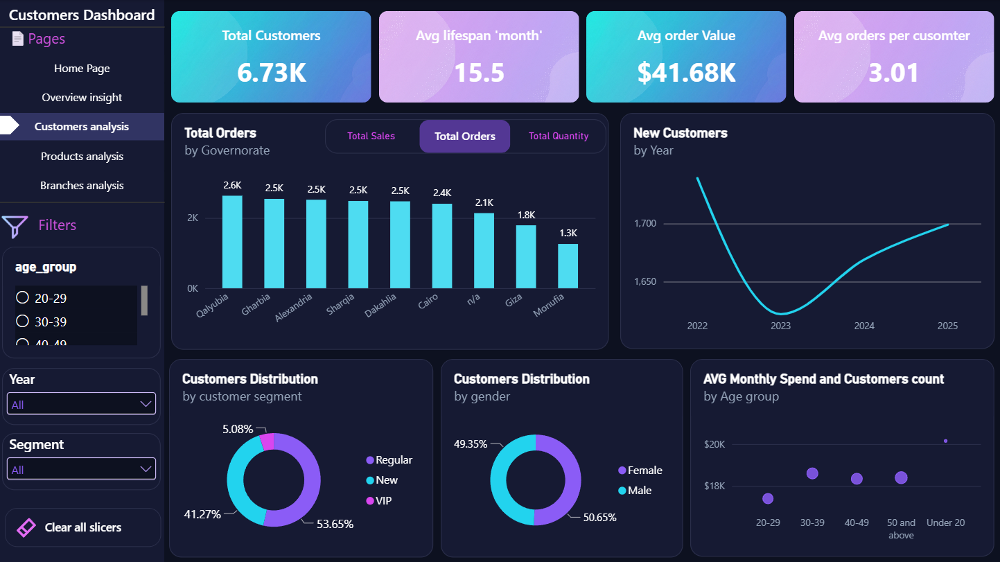
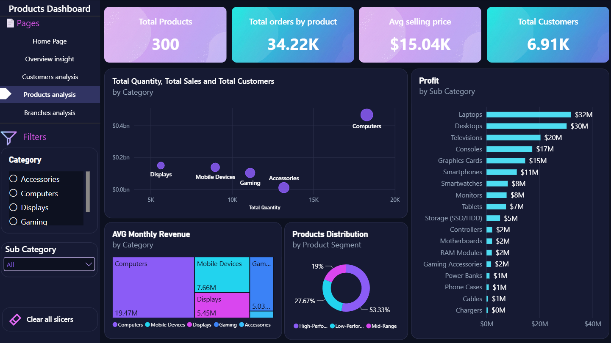
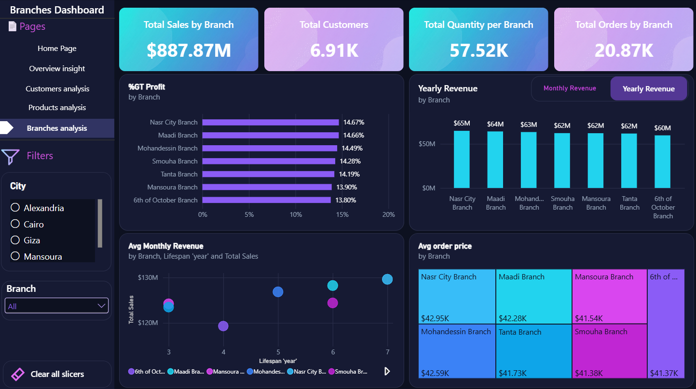

# 📊 Power BI Dashboard

An interactive, 4-page Power BI dashboard built directly on top of the
`gold` Star Schema, turning the warehouse's data into a business-ready
visual report — no spreadsheets, no manual data pulls.

---

## 📌 Overview

This dashboard is designed to answer the day-to-day questions a retail
business actually asks: how are we doing overall, who are our customers,
which products perform best, and which branches drive the most value.
It connects live to the `gold` layer views (`dim_customers`,
`dim_products`, `dim_branches`, `fact_sales`, and the three consolidated
report views), so every number on screen reflects the current state of the
warehouse.

---

## 🗂️ Pages

### 🏠 Home
A simple navigation hub linking to every analysis page, so any viewer —
technical or not — can jump straight to what they need.

### 📈 Overview

Company-wide health check at a glance:
- KPI cards: Total Sales, Total Quantity, Total Orders, Total Profit
- Sales trend over time, toggleable between **Total Sales** and **Total
  Profit** on the same chart
- Orders broken down by customer governorate
- Orders and quantity by day of the week
- Top-selling products, with a **5 / 10 / 15** selector to control how many
  are shown

### 👥 Customers Analysis

A closer look at who the customers are and how they behave:
- KPI cards: Total Customers, Average Customer Lifespan (months), Average
  Order Value, Average Orders per Customer
- Orders by governorate, toggleable between Sales / Orders / Quantity
- New customer growth by year
- Customer segmentation (**VIP / Regular / New**) and gender distribution
- Average monthly spend by age group

**Filters available:** Age Group, Year, Customer Segment

### 📦 Products Analysis

Product and category-level performance:
- KPI cards: Total Products, Total Orders, Average Selling Price, Total
  Customers
- A bubble chart comparing Total Quantity, Total Sales, and Total Customers
  side-by-side across categories
- Average monthly revenue by category
- Profit by sub-category
- Product distribution by performance segment (High / Mid / Low performer)

**Filters available:** Category, Sub-Category

### 🏢 Branches Analysis

Branch-level performance and comparison:
- KPI cards: Total Sales, Total Customers, Total Quantity, and Total
  Orders — all by branch
- Each branch's percentage contribution to overall profit
- Yearly revenue by branch, toggleable with monthly revenue
- Branch lifespan vs. total sales, to spot whether older branches
  outperform newer ones
- Average order value per branch

**Filters available:** City, Branch

---

## ✨ Design & Interactivity

- **Consistent dark theme** across every page for a clean, modern look
- **Reusable KPI card layout** — the same visual language is used on every
  page, so the dashboard feels like one product rather than four separate
  reports
- **Metric toggle buttons** — several charts let the viewer switch what's
  plotted (e.g. Sales vs. Profit, or Monthly vs. Yearly Revenue) without
  needing a separate chart for each view
- **Top N selector** on the best-selling products chart
- **Cross-page slicers** (Year, Segment, Age Group, City, Branch) so a
  viewer can filter the story that matters to them
- **Bubble charts** used where more than two metrics need to be compared
  at once (e.g. quantity, revenue, and customer count per category)

---

## 🧮 Key DAX Techniques

- `DISTINCTCOUNT()` for all customer/order counts, ensuring an entity is
  never counted more than once even when it appears across multiple
  categories or branches
- `CALCULATE()` with dynamic filter context for segment- and time-based
  measures
- Conditional/branching measures to power the metric toggle buttons
- Time intelligence for year-over-year and monthly trend visuals

---

## 🔌 Data Source

The report connects to the `gold` schema of the `DataWarehouse` SQL Server
database:

| Table/View | Used For |
|---|---|
| `gold.dim_customers` | Customer demographics, segment, region |
| `gold.dim_products` | Product catalog, category, sub-category |
| `gold.dim_branches` | Branch details and location |
| `gold.fact_sales` | Sales transactions (grain: order line item) |
| `gold.report_customers` | Pre-aggregated customer KPIs |
| `gold.report_products` | Pre-aggregated product KPIs |
| `gold.report_branches` | Pre-aggregated branch KPIs |

Because Gold is implemented as SQL views (not physical tables), the
dashboard always reflects the latest data in Silver with no separate BI
refresh pipeline required.

---

## 🚀 How to Open

1. Set up the Data Warehouse first — see the root [`README.md`](../README.md)
   for the full setup steps.
2. Open `Dashboard.pbix` in **Power BI Desktop**.
3. When prompted, point the data source to your local `DataWarehouse`
   database.
4. Refresh the report — all pages will populate from the `gold` schema.

---

## 🛠️ Tech Stack

- **Power BI Desktop** — report authoring
- **DAX** — measures and calculated logic
- **Power Query** — data source connection
- **SQL Server** (`gold` schema) — underlying data source
